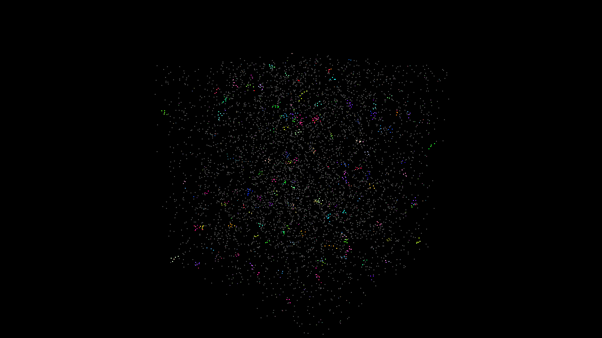
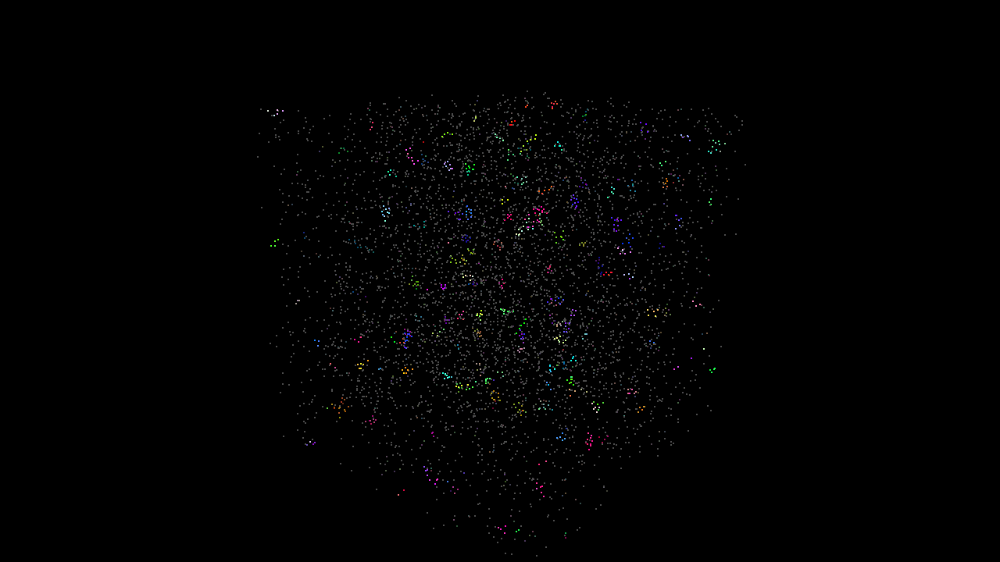
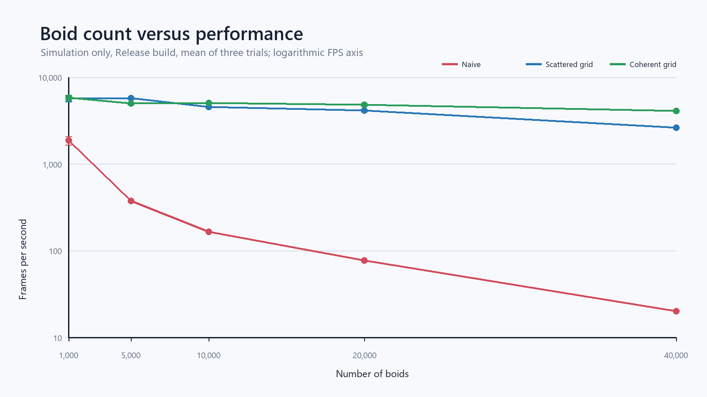
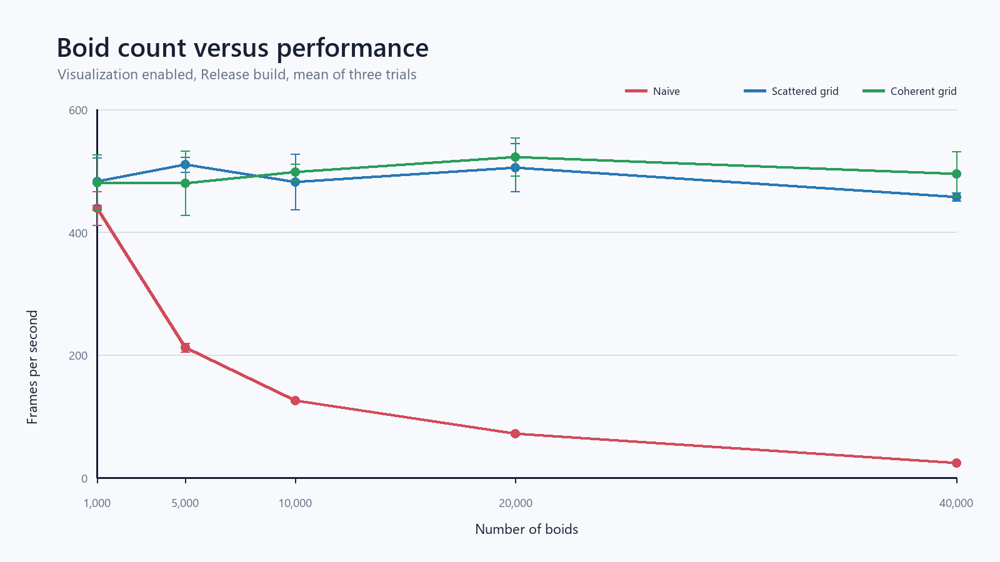
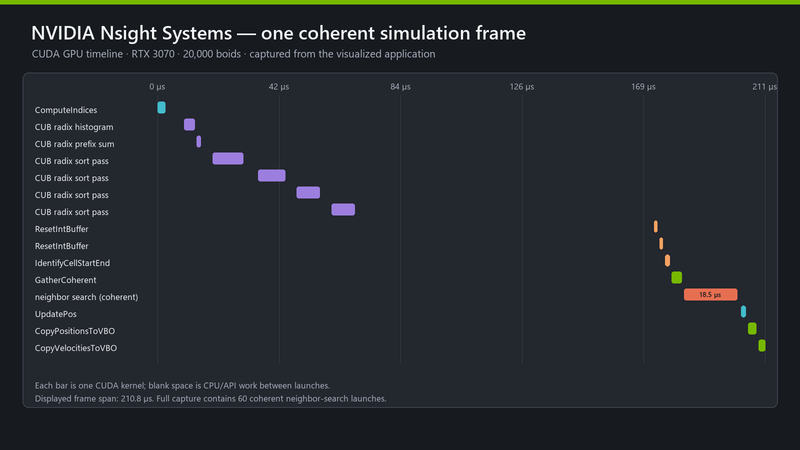
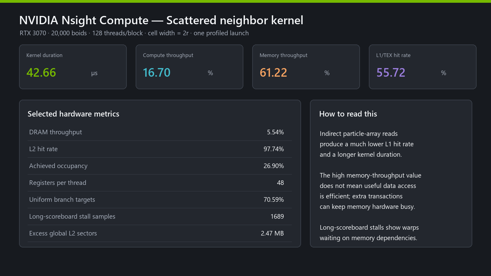
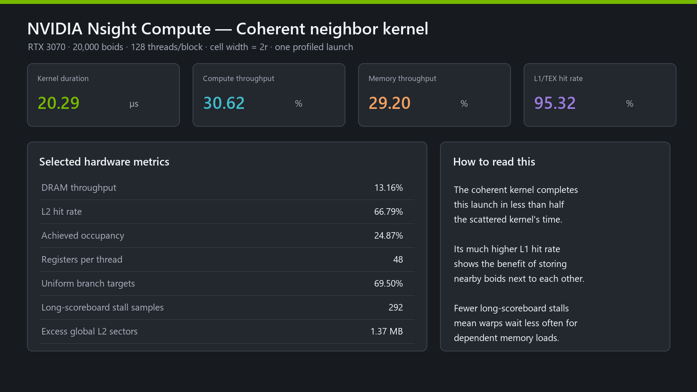
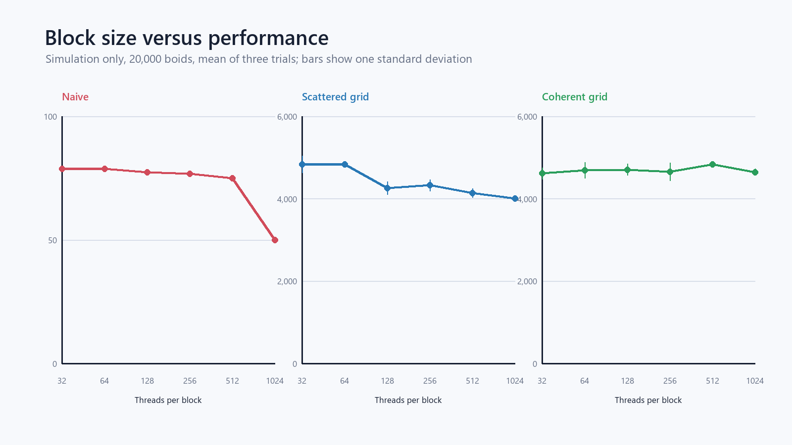
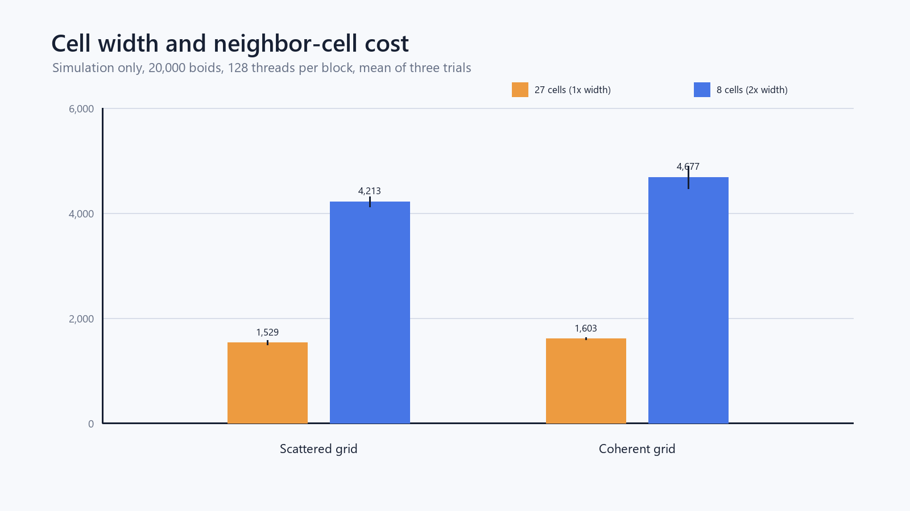

CUDA Flocking
==============

**University of Pennsylvania, CIS 5650: GPU Programming and Architecture, Project 1**

* Zachary Kelly
* Tested on: Windows 10 Pro, AMD Ryzen 7 3700X, NVIDIA GeForce RTX 3070 8 GB
* CUDA 13.3, NVIDIA driver 616.56, Release build





## Implementations

I implemented three versions of the flocking simulation:

* **Naive:** Each boid checks every other boid.
* **Scattered grid:** The boids are sorted by grid cell, but the sorted values are still
  used to look up positions and velocities in the original arrays.
* **Coherent grid:** The positions and velocities are copied into grid-sorted arrays so
  that boids in the same cell are also next to each other in memory.

## Profiling Setup

I ran the tests in Release mode. Each point in the graphs is the average of three runs,
and the error bars show one standard deviation.

For the simulation-only tests, I turned off the window and timed 100 simulation steps
after 20 warmup steps. I used CUDA events for the timing. The naive measurement includes
the velocity and position updates. The grid measurements also include creating the grid,
sorting with Thrust, finding the cell ranges, and running the neighbor search.

For the tests with visualization, I used a 1280 by 720 window and turned off VSync. I
ignored the first 60 frames and timed the next 120 frames. These measurements include the
simulation, CUDA/OpenGL buffer mapping, VBO copies, drawing, and swapping the buffers.

Unless the graph says otherwise, I used 128 threads per block and a grid cell width equal
to twice the largest rule distance. The raw data is in
[`profiling/results`](profiling/results).

## Boid Count



The naive version got much slower as I added more boids. This makes sense because every
boid checks every other boid, so the number of checks grows roughly with the square of the
boid count. At 40,000 boids, the naive version ran at 20.0 simulation steps per second.

The grid versions have to build and sort the grid first, but they only check cells that
can contain nearby boids. At 40,000 boids, scattered ran at 2,617 FPS and coherent ran at
4,073 FPS. The grid setup was worth the extra work once there were a lot of boids.



With visualization turned on, scattered and coherent both stayed around 460-520 FPS. At
that point, the simulation was fast enough that buffer mapping, copying, drawing, and
presenting the frame were a large part of the total frame time. The naive version still
slowed down because its simulation eventually became more expensive than the graphics
work.

## Coherent Compared to Scattered

The coherent version was faster in my simulation-only tests. At 20,000 boids, coherent
averaged 4,829 FPS and scattered averaged 4,149 FPS, so coherent was about 16% faster. At
40,000 boids, coherent averaged 4,073 FPS and scattered averaged 2,617 FPS, making coherent
about 56% faster.

This is what I expected. In the scattered version, the sorted particle indices lead back
to positions and velocities spread throughout the original arrays. In the coherent
version, nearby boids are stored next to each other. This gives the threads better memory
access and becomes more useful as the number of boids increases.

## NVIDIA Nsight

I used Nsight Systems on the full visualized program and Nsight Compute on one launch of
each neighbor-search kernel. I generated the images below from the exported profiler data
so the important values are easy to read. The exported data and original `.ncu-rep` files are in [`profiling/results`](profiling/results). Run `profiling/run_nsight_profiles.ps1` to regenerate the interactive Nsight Systems report.



The Systems timeline shows the steps in one coherent-grid frame. It computes the grid
indices, sorts them, resets and fills the cell ranges, gathers the coherent arrays, runs
the neighbor search, updates the positions, and copies the results to the OpenGL VBOs.
The blank areas are CPU or CUDA API work between kernel launches.

In the full capture, the coherent neighbor kernel used 28.8% of the CUDA kernel time. The
CUB radix-sort kernels used about half of the kernel time together. This showed me that
both sorting the grid and searching for neighbors are important parts of the frame.





For 20,000 boids, the coherent neighbor kernel took 20.29 microseconds and the scattered
kernel took 42.66 microseconds. The coherent L1/TEX hit rate was 95.32%, compared with
55.72% for scattered. Long-scoreboard stall samples also dropped from 1,689 to 292. These
stalls happen when a warp is waiting for a memory result that another instruction needs.

The results match the reason for making the coherent version. Keeping nearby boids next
to each other improved the cache hit rate and made the kernel wait less for memory. Nsight
Compute replays the kernel to collect its counters, so I used the CUDA-event measurements
instead of the Compute duration for the final FPS graphs.

## Block Size and Block Count



Changing the block size also changes the number of blocks. I calculated the block count
with `ceil(numberOfBoids / blockSize)`. Smaller blocks give the GPU more blocks to schedule,
while very large blocks can limit how many blocks fit on one streaming multiprocessor.

For naive, 32 and 64 threads per block were fastest at about 78.8 FPS. It dropped to 49.8
FPS with 1,024 threads. Scattered was also fastest around 32-64 threads and slowly dropped
with larger blocks. Coherent stayed around 4,600-4,830 FPS and was fastest at 512 threads.

There was not one block size that was best for every version. I kept 128 as the common
size because it performed reasonably well for all three implementations.

## Cell Width: 27 Cells Compared to 8 Cells



Using a cell width twice the largest rule distance means a boid searches at most eight
cells. This was 2.76 times faster for scattered and 2.92 times faster for coherent than
using a cell width equal to the rule distance and searching as many as 27 cells.

The smaller cells can contain fewer boids, so the 27-cell version can sometimes perform
fewer particle distance checks. In my test, however, it had to run more grid-loop
iterations and perform more cell start/end lookups. A lot of the cells were also empty.
That extra work was more expensive than checking the larger eight cells.

## Reproducing the Results

I ran these commands from PowerShell in the repository root:

```powershell
cmake --build build --config Release --parallel
powershell -ExecutionPolicy Bypass -File .\profiling\run_profiles.ps1 -Trials 3
powershell -ExecutionPolicy Bypass -File .\profiling\capture_boids.ps1
py .\profiling\make_outputs.py
powershell -ExecutionPolicy Bypass -File .\profiling\run_nsight_profiles.ps1
```

I used this command for one simulation-only measurement:

```powershell
.\build\bin\Release\cis5650_boids.exe --benchmark coherent 20000 128 2 20 100
```

The arguments are the implementation, boid count, block size, cell-width multiplier,
warmup steps, and measured steps. The program prints the average milliseconds per step and
FPS.

I used this command for one measurement with visualization:

```powershell
.\build\bin\Release\cis5650_boids.exe --window-profile coherent 20000 128 2 60 120
```

This measures the entire rendered frame. VSync is disabled while profiling.
